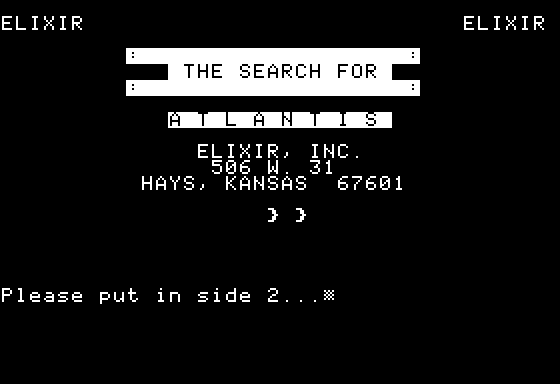
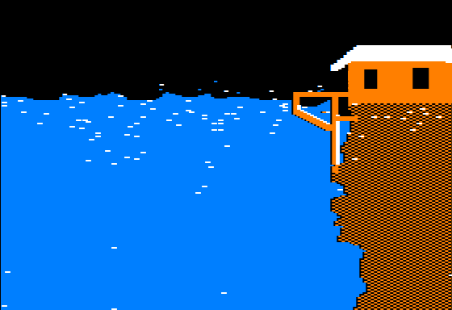
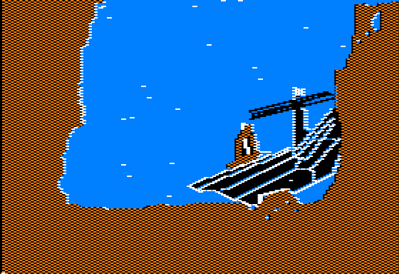
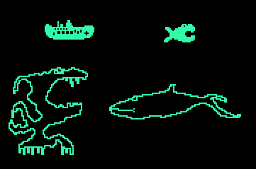

# Search for Atlantis
Beginnings of a game made on the Apple II in Feb 1988. The game runs in ProDOS and attempts to load the Beagle Compiler (not included) into memory.

<figure>

<figCaption>Video capture of SFAFIX.BAS running with the Beagle Compiler in memory. Submarine visits background files 1-11 using the macOS emulator, Virtual ][. Backgrounds 12-27 did not fit on the disk with the main program, and are only viewable using a "viewer" utility program (all backgrounds are shown in the <a href='./screen-capture/sfa-all-screens-montage.png'>still montage</a>).

<ul>
<li><a href="./screen-capture/sfa-short-video.mp4">sfa-short-video mp4</a></li>
<li><a href="./screen-capture/sfa-long-video.gif">sfa-long-video gif</a></li>
<li><a href="./screen-capture/sfa-viewer-backgrounds-01-11.mov">sfa-viewer-backgrounds-01-11.mov</a></li>
<li><a href="./screen-capture/sfa-viewer-backgrounds-12-27.mov">sfa-viewer-backgrounds-12-27.mov</a></li>

</ul>
</figCaption>
</figure>

<figure>

<figCaption>Search for Atlantis has 27 unique background images. The files were drawn using a Koala Pad on the Apple IIe.</figCaption>
</figure>

<figure>

<figCaption>The submarine and three other sprites were drawn in Shape Table Maker.</figCaption>
</figure>

<figure>

<figCaption>This montage shows the layout of the screens in a 10 x 10 grid. Some backgrounds repeated (such as open water).</figCaption>
</figure>