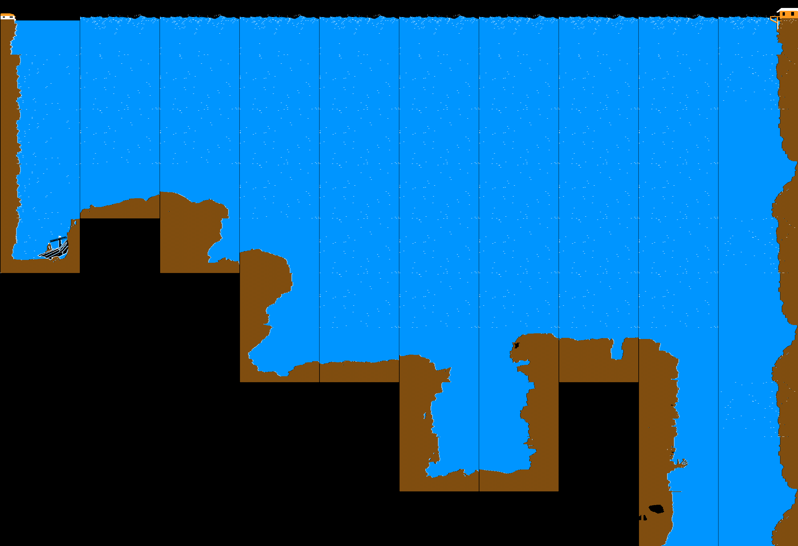

# search-for-atlantis-apple-ii
Beginnings of a game made on the Apple II in Feb 1988. The game runs in ProDOS and attempts to load the Beagle Compiler (not included) into memory.

<figure>

<figCaption>Video capture navigating the background files 1-11 using the macOS emulator, Virtual ][. Backgrounds 12-27 did not fit on the disk with the main program, and are only viewable using a "viewer" utility program.</figCaption>
</figure>

<figure>

<figCaption>Search for Atlantis has 27 unique background images. The files were drawn using a Koala Pad on the Apple IIe.</figCaption>
</figure>

<figure>

<figCaption>The submarine and three other sprites were drawn in Shape Table Maker</figCaption>
</figure>

<figure>

<figCaption>This montage shows the layout of the screens in a 10 x 10 grid. Some backgrounds repeated (such as open water).</figCaption>
</figure>